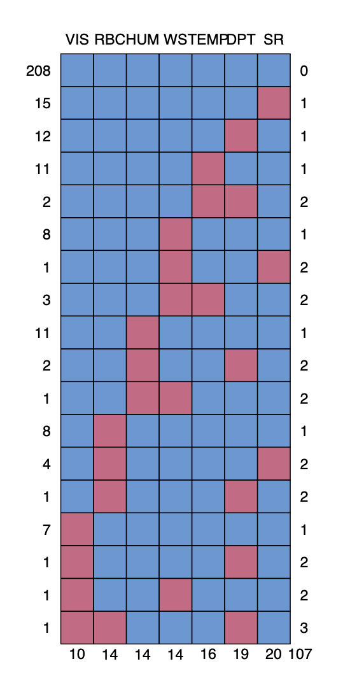
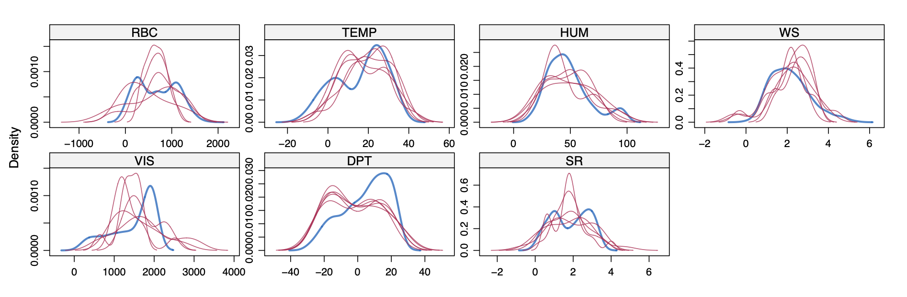
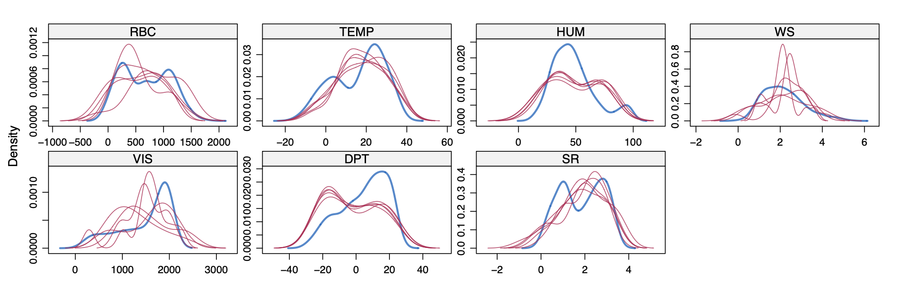
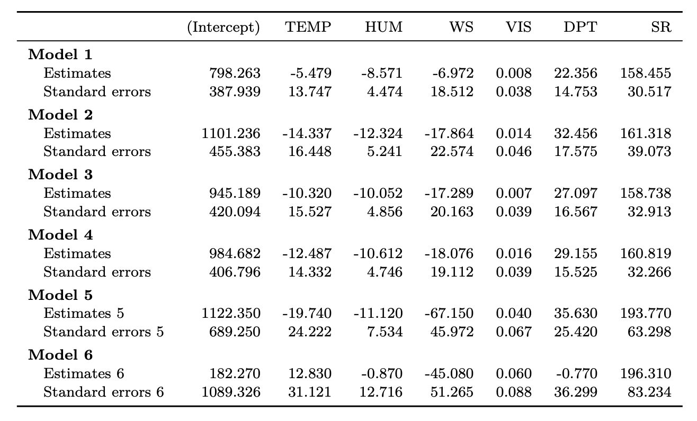

# Missing Data Experiment: Multiple Imputation with the MICE Algorithm 

It is common to encounter data sets where some of the values are missing, for example, in a sample survey if a respondent does not answer all the questions, or if a process for recording data wasn’t working on a particular day. If we fit a linear model in R using these data, R will ignore any row with a missing value. This is sometimes referred to as a **Complete Case Analysis**.

**Multiple Imputation by Chained Equations (MICE)** is a sophisticated technique for handling missing data. Instead of filling in missing values with a single estimate, MICE creates multiple complete datasets by imputing missing values multiple times. Each dataset is then analyzed separately, and the results are combined to account for the uncertainty associated with the missing data.

The MICE algorithm works by iteratively imputing each missing value based on the other variables in the dataset. It uses a series of regression models to predict missing values, ensuring that the relationships between variables are preserved. This method provides more accurate and reliable results compared to single imputation methods (Mean Imputation, Median Imputation, Interpolation).

The objective of this project is to compare the effectiveness of two different approaches for handling missing data. All corresponding codes (R markdown) can be found in the [mice_markdown.Rmd](https://github.com/atomxu10/TimeSeriesProject/blob/main/tsp.Rmd).

## Content
- [Data](#1)
- [Model (Multiple Linear Regression)](#2)
- [Exploratory data analysis](#3)
- [Method](#4)
- [Convergence of the MICE algorithm](#5)
- [Results](#6)
- [Conclusion](#7)

## Data
SeoulBikeData ([databike.csv](https://github.com/atomxu10/MultipleImputation_MICE/blob/main/databike.csv)) is a dataset containing information about bike rentals in Seoul, South Korea. The dataset is provided by the Seoul Metropolitan Government, and there are 297 datasets in total, which can be used for data analysis and prediction.

The variables are :
- Rented Bike Count (RBC): The number of bikes rented per hour.
- Temperature (TEMP): The temperature in Celsius.
- Humidity (HUM): The relative humidity.
- Wind speed (WS): The wind speed in meters per second.
- Visibility (VIS): The visibility in meters.
- Dew point temperature (DP): The dew point temperature is Celsius.
- Solar radiation (SR): The solar radiation in MJ/m2.

All variables data types are continuous.

## Model (Multiple Linear Regression)
Multiple Linear Regression is a regression analysis method used to establish a linear relationship between multiple independent variables and a dependent variable, and all variables are numerical variables. In this case, all variable categories are continuous, so linear regression can be used to explain the relationship between variables, RBC is defined as an independent variable, and the others are dependent variables. The regression model can be represented as:

$$
Y_i = \beta_0 + \beta_1 X_{1i} + \beta_2 X_{2i} + \beta_3 X_{3i} + \beta_4 X_{4i} + \beta_5 X_{5i} + \beta_6 X_{6i} + \epsilon_i
$$

where $\epsilon \sim N(0, \sigma^2)\$

In the above formula, $Y_i$ is the value of the independent variable RBC, $X_{1i}$. . . $X_{6i}$ represent the values of the dependent variables TEMP, HUM, WS, VIS, DPT, SR respectively, and $\beta_1$. . . $\beta_6$ represent the coefficients of each dependent variable.

## Exploratory data analysis
After modifying the dataset to have missing data (proportions of missing data = 0.05), it can be seen that 208 observations are complete, accounting for 70% of the total data (Figure 1). Each variable in the data set has missing values, among which the variable with the most missing values is SR (20), and the least is VIS (10). Among all observations with missing values, there are 72 observations with missing single variables, accounting for 80.9%. There are 16 observations with two variables missing and 1 observation with three variables missing.

The missing data are completely random, which belongs to the MCAR type of missing data mechanisms and the missing data is not affected by any other variables.

    

Figure 1: Missing data pattern of the dataset

## Method
**1. Fitting a benchmark model**
   
   The full data set (without missing values) is fitted with a linear regression model to obtain the estimated values and standard errors of each parameter. The model does not need to consider multicollinearity. It is only used for subsequent comparative analysis.

**2. Modifying the data set to have missing data**

   A seed number should be set so that missing data is constant to compare multiple models. Modifying the full data set according to 0.05 proportions of missing data, and generating a new data set (208 complete observations in the modified data set).

**3. Complete case analysis**

   Complete case analysis is a linear regression fitting using the modified data directly. During linear regression in R, observations with missing values would be removed. In this case, 89 observations will be deleted.

**4. Multiple imputation with the MICE algorithm**
   
   Multiple imputation with the MICE algorithm is a technique for imputing missing data that involves generating multiple datasets by using regression models to estimate missing values. The MICE algorithm is widely used because it can handle different types of variables and missing data patterns. The methods “norm” and “pmm” in the MICE package will be used.

   - “norm” - Assuming the distribution of the data is a normal distribution and using the mean and variance to generate random values from that distribution.
   - “pmm” - Missing values are assumed to have similar characteristics to other data points. When selecting similar data points, the difference between these data points and the missing value is calculated, and the value of the closest data point is selected according to the size of the difference to fill the missing value.

By checking the convergence of the MICE algorithm after using different methods, we can get the number of imputations and iterations.

**5. Fitting linear regression model using the data set after MICE multiple imputation**

   Fitting the data set after MICE multiple imputation to a linear regression model to obtain the fitted models (the number of models is the number of imputations). Pooling our analyses together from multiple models (pool function) as the final fitting model. Estimated values and standard errors of each parameter would be obtained.

**6. Trying different proportions of missing data**
    
   Trying to change the proportions of missing values in step 2, repeat the steps from 3 to 5 to get new model parameters, and comparing the estimated values and standard errors of each parameter of each model.

## Convergence of the MICE algorithm

When using multiple imputation with the MICE algorithm, checking converges can determine whether the number of iterations of the imputation and the number of imputations are sufficient. If there is no convergence, it means that the number of imputations and iterations needs to be increased. I will use the density plot as an example to check convergence.
Each variable has its own density curve, which roughly displays a normal distribution curve. If converges, the density curve after each iteration will not change much, and the shapes tend to coincide. Figure 2 and Figure 3 are density plots with iterations of 1 and 20 respectively (the number of interpolations is 5). By comparison, it is seen that the red line distribution in Figure 3 is roughly bell-shaped compared with Figure 2, and the overlapping degree is higher. Therefore, it can be concluded that the convergence performance is good when the number of iterations is 20.

    

Figure 2: Density plots for each variable (m = 5,maxit = 1). the overlapping degree is lower

    

Figure 3: Density plots for each variable (m = 5,maxit = 20). the overlapping degree is higher so it is convergent

## Results
Linear regression fit with different data sets:

- Model 1: the full data set (no missing data)
- Model 2: the modified dataset (proportions of missing data = 0.05)
- Model 3: the modified dataset (proportions of missing data = 0.05) and multiple imputation with MICE (method: “norm”)
- Model 4: the modified dataset (proportions of missing data = 0.05) and multiple imputation with MICE (method: “pmm”)
- Model 5: the modified dataset (proportions of missing data = 0.4) and multiple imputation with MICE (method: “norm”)
- Model 6: the modified dataset (proportions of missing data = 0.4) and multiple imputation with MICE (method: “pmm”)

    

Table 1: Estimates and Standard errors of each parameter in different models

Table 1 displays the regression coefficients and standard errors for each parameter across different models. It is observed that most parameter estimates for Model 3 and Model 4 fall between those of Model 1 and Model 2. The parameters obtained by imputing missing values are “closer” to those derived from the full data set.

Model 1, which uses complete observations, has the smallest standard errors for each parameter, indicating a more precise estimation. In contrast, Model 2, which involves simply deleting incomplete data, exhibits the largest standard error for its parameters. This suggests that the approach of merely omitting missing data leads to a less reliable model fit.

The standard errors for the parameters in Model 3 and Model 4, which utilize multiple imputation with the MICE algorithm, are significantly lower than those in Model 2. This indicates that multiple imputation can effectively reduce the standard errors of the parameters, thereby improving the model fit. The improvement in the fitting effect of the models using multiple imputation is noteworthy, highlighting the efficacy of this approach in handling missing data.

Table 1 compares different imputation methods (“norm” and “pmm”), revealing key insights into their effectiveness. It is observed that the parameter estimates in Model 4, which employs the “pmm” method, are “closer” to those in Model 1 compared to Model 3, which uses the “norm” method. Additionally, the standard errors of the parameters in Model 4 are smaller than those in Model 3, indicating that the “pmm” imputation method provides a better fit for the dataset when the proportion of missing data is 0.05.

However, as the proportion of missing data increases to 0.4, the situation changes. In this case, using multiple imputations with the MICE algorithm and the “norm” method results in a better model fit compared to using the “pmm” method. This demonstrates that while “pmm” is effective for lower proportions of missing data, the “norm” method becomes more reliable as the amount of missing data increases.

## Conclusion

The model that fits the complete dataset contains the most information about the data, resulting in superior model interpretation. In this scenario, the dataset with no missing data has the smallest standard errors for its parameters, leading to more effective data interpretation.

There are various ways to handle missing data. Directly ignoring missing values and performing linear regression will exclude any rows with missing values, which reduces the sample size. This is particularly problematic when the proportion of missing data is large, as it leaves fewer valid observations and thus less information. Consequently, the model exhibits poor fit and high standard errors for each parameter.

By comparing the estimated values and standard errors of the parameters for each model, it is evident that using the MICE missing value imputation method improves model fitting. The choice of imputation method is crucial for datasets with different proportions of missing data. In this case, when the proportion of missing values is small, the standard errors of the parameters fitted using the "pmm" method are smaller. However, as the proportion of missing values increases and the number of complete observations decreases, the dataset processed with the "norm" method results in a better model fit.

In summary, selecting the appropriate imputation method based on the proportion of missing data is vital for achieving accurate model fitting and reliable parameter estimates.

